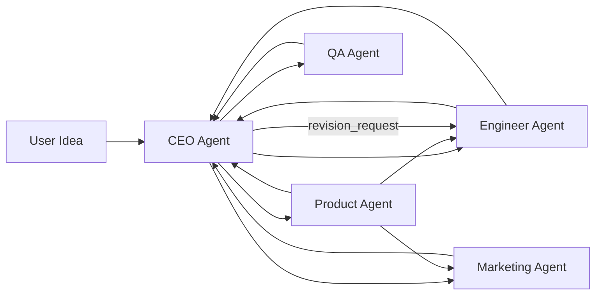

# PitchBot

PitchBot is a multi-agent startup simulator. You provide one startup idea, and five AI agents collaborate to define the product, build a landing page, create marketing assets, and run QA with feedback loops. The system uses live inter-agent messaging and external platform actions so the full pipeline can be demonstrated end-to-end.

## Agent Architecture

### Agent communication flow



### Runtime channels (Redis Pub/Sub)

- `ceo`
- `product`
- `engineer`
- `marketing`
- `qa`

All messages are structured JSON with: `from_agent`, `to_agent`, `message_type`, `payload`, `timestamp`, and `message_id`.

## Setup Instructions

### 1. Clone the repository

```bash
git clone <YOUR_REPO_URL>
cd PitchBot
```

### 2. Create and activate virtual environment

```bash
python3 -m venv .venv
source .venv/bin/activate
```

### 3. Install dependencies

```bash
pip install -r requirements.txt
```

### 4. Configure environment variables

Copy `.env.example` to `.env`, then set keys for:

- LLM provider/model routing (CEO and other agents)
- GitHub token and target repository
- Slack bot token and channel
- SendGrid API key and emails
- Redis URL

```bash
cp .env.example .env
```

### 5. Start the dashboard server

```bash
python -m uvicorn server:app --reload --port 8000
```

Open: `http://localhost:8000`

### 6. Start the run from UI (current default flow)

Use the landing page in the browser:

- Click Get Started
- Enter startup idea
- Click Start Collaboration

The backend receives the startup idea over WebSocket and automatically launches `main.py` as a subprocess.

### 7. Optional manual mode

In a second terminal:

```bash
python main.py
```

Use manual mode only if you do not want UI-triggered orchestration.

## Demo Commands (Quick Copy)

Terminal 1:

```bash
cd /path/to/PitchBot
source .venv/bin/activate
python -m uvicorn server:app --reload --port 8000
```

Terminal 2 (optional log reset before recording):

```bash
cd /path/to/PitchBot
printf '[]\n' > logs/message_log.json
```

Terminal 3 (manual mode only):

```bash
cd /path/to/PitchBot
source .venv/bin/activate
python main.py
```

## Platforms and Integrations

- Redis:
	- Pub/Sub message bus between agents
	- Backing stream for live dashboard updates
- OpenAI-compatible LLM endpoint:
	- Used by Product, Engineer, Marketing, and QA agents for generation/review tasks
- Gemini:
	- Used by CEO agent for decomposition and evaluation
- GitHub:
	- Engineer agent creates issue, branch, commit, and pull request
	- QA agent posts PR review comments
- Slack:
	- Marketing posts launch message
	- Main process posts final run summary
- SendGrid:
	- Marketing sends outreach/cold email
- FastAPI + WebSockets:
	- Serves dashboard and streams live agent events to browser

## Slack Workspace Evidence

- Slack workspace invite link:
	- `https://join.slack.com/t/<YOUR-WORKSPACE>/shared_invite/<YOUR-INVITE-CODE>`
- If invite sharing is restricted, include screenshots in repository under `docs/slack/` and reference them here.

## Engineer Agent GitHub PR

- Example PR created by Engineer agent:
	- https://github.com/ABDULAH-ab/Startup/pull/10

## Group Members

- Abdullah 22I-1879
- Yousha Saibi 22L-7482


